# REDCap module: Advanced Graphs for Reports
This REDCap module displays additional advanced graphs in a dashboard from a report in an easy and secure way for REDCap projects. 

The type of graphs generated include bar charts, stacked bars, grouped bars, pie charts, Likert scale graphs, 
scatter plots, line graphs, tabulations and cross tabulations, geographical maps and networks. 
Graphs and tables use labels taken from field names and options/categories defined in the data dictionary.


## Prerequisites
- REDCap >= 13.1.25 (It hasn't been tested for previous versions but it may still work for recent ones).

## Easy Installation

For REDCap administrators:

- Obtain this module from the Consortium [REDCap Repo](https://redcap.vanderbilt.edu/consortium/modules/index.php) from the control center.
```
- Go to **Control Center > External Modules** and enable Advanced Graphs for Reports.
```
- Enable how projects will use Advanced Graphs
```


## Manual Installation
For REDCap administrators:

- Clone this repo into `<redcap-root>/modules`.
```
git clone https://github.com/victormeb/Advanced-Graphs-v4.0.0.git
```

## Project Configuration

- To activate this module for a particular project, go to the project home page, click on the **External Modules - Manage** 
link and, in the new page, enable the Advanced Graphs for Reports module. 
<br/><br/>

<hr>
## Usage
<hr>
### Dashboard creation

To create an Advanced Graphs dashboard, you need to have **open** in your screen a regular REDCap 
report and click the **New Advanced Graphs** bookmark under the External Modules section, on the left hand side menu.

That takes you to the Advanced Graphs editor page. You can start creating your dashboard, assign a title 
and add graphs (see below).

A dashboard can be set as a **Public** dashboard.


### Add a Graph or Table

The type of graphs or tables that can be displayed are selected automatically from the **type of fields** included in the report. 

With few clicks, you can easily **add graphs or tables** to the dashboard, which is organized as a 
**matrix of visualization elements**. If needed, you can add a row to the dashboard. 
You can select the type of graph, the instrument and the fields you want to plot from the available list of fields.

Fields considered by this module are **categorical** (radio buttons, dropdown lists, checkboxes or yes/no fields), 
**numeric**, **dates**, **calculated fields** and **plain text fields**. By selecting the type of graph you want to plot,
the module automatically makes available the fields you can use; the External Module considers **key words** 
in the field name for geographic maps (need to include the word "longitude" and "latitude".

You can add a title and description to each graph. You can decide on some options to manage N/A responses, color 
and possibly a couple more specific self-explained options related to the type of graph or table selected.

When you have added all the graphs and tables you want to include in your dashboard, simply save it. One option after saving 
would be to see the dashboard, if you want to do so.

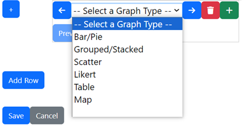

### Graphs or Tables customization

Once a dashboard has been created, there is a link available to the "Advanced Graphs Dashboards" page,  
located in the LHS menu, under the "External Modules" section. From there, you can view, edit or delete any 
existing dashboard in your project.

Once you are in the editor page for your dashboard, you can **preview** each graph and, 
if you wish, you can **customized** almost all their graphic elements: 
titles, text orientation, legends, labels, comments, margins, colors or graphs variations (like selecting bars or pies or donuts). 
This work is done by simply using buttons and slide controls. Options available vary from each type of graph or bar selected.

You may need to interact several times adjusting some elements for a graph and preview them again to see the results; 
then you can do more adjustments, until you get the results you need.

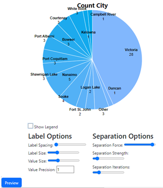

### Display Dashboards

To display any of the dashboards already created, you can click the **Advanced Graphs Dashboards** link under 
the External Modules section. You can **display, open the public link** (if selected previously), **edit or delete** each dashboard.

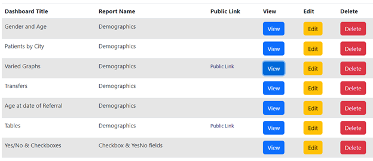

### Events and Repeated events/instruments 

#### Events

??? When there are multiple events included in the report, records will be flattened into a single row by choosing 
the first non-empty row per record ID. If there are repeating instruments **It is necessary to check the "Include 
the repeating instance fields"** under **Additional report options** in the report editor.

## Graphs included
The types of graphs and tables this module can generate are:

<hr>
**BAR, PIE OR DONUTS GRAPHS**
<hr>
Bar/pie/donut graphs are displayed for radio buttons, drop-down list and yes/no fields, using different colors 
and including bar values, among other elements.

Customization elements for this type of graph are:

Title, description, type of graph: bar/pie/donut, field to plot, value of height (simple count or 
a function of another field values, inclusion/exclusion of missing data or unused values (useful when having many colums), 
palette color, margins, legend inclusion/exclusion, X and Y axes and bar labels formatting.
<br /><br/>


<hr>
**STACKED BARS AND GROUPED BARS**
<hr>
These are bars relating two or even three fields. 
Each bar represents either the frequency of a category for a radio, dropdown or yes/no field, 
or the numeric value of a third numerical text field calculated by a selected function (sum, mean, min, max).<br/>
 
For stacked bars, bars are broken in parts that represent the frequency of another categorical field.<br/><br/>

Customization elements for this type of graph are:

Title, description, type of graph: stacked/grouped, two fields to plot, value of height (simple count or 
a function of another field values), inclusion/exclusion of missing data or unused values (useful when having many colums), 
palette color, margins, legend inclusion/exclusion, X and Y axes and bar labels formatting.
<br /><br/>

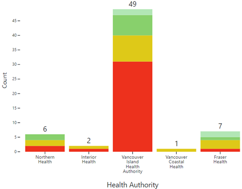 
&nbsp;&nbsp;&nbsp;&nbsp;&nbsp;&nbsp;&nbsp;&nbsp;&nbsp;&nbsp;&nbsp;&nbsp;&nbsp;&nbsp;&nbsp;&nbsp;&nbsp;&nbsp;&nbsp;&nbsp;
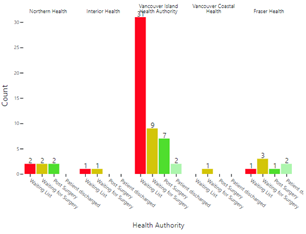

<hr>
**TABULATIONS**
<hr>

Tables can be displayed for one or two categorical fields, with counts and/or percentages for each cell and totals. 

For cross tabulations, percentages can be referred by row, column or table.

Customization elements for tables are:

Title, description, type of table: summary/crosstab, field to plot, cell value (simple count or 
a function of another field values), inclusion/exclusion of missing data or unused values, totals/percents/both, 
palette color.
<br /><br />

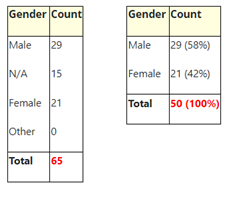
&nbsp;&nbsp;&nbsp;&nbsp;&nbsp;&nbsp;&nbsp;&nbsp;&nbsp;&nbsp;&nbsp;&nbsp;&nbsp;&nbsp;&nbsp;&nbsp;&nbsp;&nbsp;&nbsp;&nbsp;
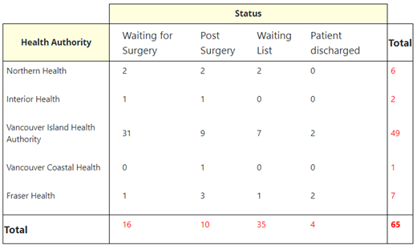

<hr>
**LIKERT SCALE**
<hr>
These are bar graphs specifically designed to describe participants preference (ordinal with positive/negative) options, 
especially useful in surveys, in a graphic format common in literature.<br /><br />
It detects if in a radio or dropdown field there is an option with phrases like 
"not useful", "not at all useful", "difficult", "none of my needs", "strongly disagree", "somewhat disagree", 
"completely disagree", "quite dissatisfied", "very dissatisfied", "Extremely dissatisfied", "poor", "never", 
"worse", "severely ill", or equivalent in Spanish.<br />

It groups all selected fields having the same type of response. 
It presents bar segments with the percentage of responses for each response, following a street lights pattern.

Customization elements for Likert scale graphs are:

Title, description, likert choices to consider, field(s) to plot, inclusion/exclusion of missing data, 
palette color, legend inclusion/exclusion, X and Y axes and bar labels formatting.
<br /><br />


<hr>
**SCATTER PLOT**
<hr>
Representation of a bi-dimensional dots or line graph relating two text fields, either numeric or with date format.

Customization elements for scatter plots are:

Title, description, type of graph: dots/line, two numeric/date fields to plot, type of dot: circle/diamond/triangle, 
inclusion/exclusion of missing data or unused values (useful when having many colums), 
palette color, X and Y axes and dots formatting.
<br /><br />

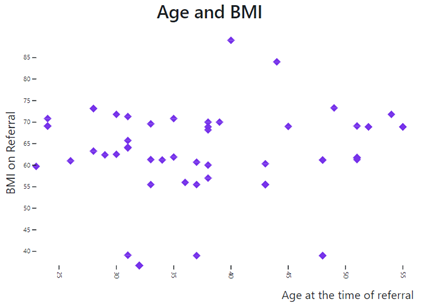 
&nbsp;&nbsp;&nbsp;&nbsp;&nbsp;&nbsp;&nbsp;&nbsp;&nbsp;&nbsp;&nbsp;&nbsp;&nbsp; 
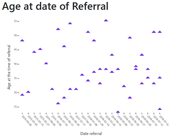

<hr>
**GEOGRAPHIC MAPS**
<hr>
Fields containing coordinates that are included in a REDCap report can create a geographical map. 

It identifies a couple of fields with the same label, except for the words "longitude" and "latitude". 

Dots size may represent the number of cases by location or weighted by another field values; close 
locations can be clustered. 

The resulting map can be zoomed in and out.

Customization elements for maps are:

Title, description, points cluster type: location/counts, two coordinate fields to plot, location identifier and field weight
and weight value (as count or a function of field weight), palette color, legend inclusion/exclusion, cluster locations 
formatting.
<br /><br />

&nbsp;&nbsp;&nbsp;&nbsp;&nbsp;&nbsp;&nbsp;&nbsp;&nbsp;&nbsp;&nbsp;&nbsp;&nbsp; 
&nbsp;&nbsp;&nbsp;&nbsp;&nbsp;&nbsp;&nbsp;&nbsp;&nbsp;&nbsp;&nbsp;&nbsp;&nbsp; 
**Location Counts**
&nbsp;&nbsp;&nbsp;&nbsp;&nbsp;&nbsp;&nbsp;&nbsp;&nbsp;&nbsp;&nbsp;&nbsp;&nbsp; 
&nbsp;&nbsp;&nbsp;&nbsp;&nbsp;&nbsp;&nbsp;&nbsp;&nbsp;&nbsp;&nbsp;&nbsp;&nbsp; 
&nbsp;&nbsp;&nbsp;&nbsp;&nbsp;&nbsp;&nbsp;&nbsp;&nbsp;&nbsp;&nbsp;&nbsp;&nbsp; 
**Location Clusters**

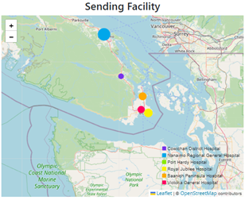
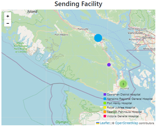

&nbsp;&nbsp;&nbsp;&nbsp;&nbsp;&nbsp;&nbsp;&nbsp;&nbsp;&nbsp;&nbsp;&nbsp;&nbsp; 
&nbsp;&nbsp;&nbsp;&nbsp;&nbsp;&nbsp;&nbsp;&nbsp;&nbsp;&nbsp;&nbsp;&nbsp;&nbsp; 
**Location Categories**

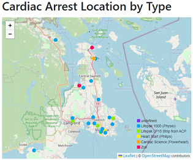

<br/>
<hr>
**NETWORKS**
<hr>
Graphical representation of text fields connected by content; 
it can represent a network of connecting exposure.<br /><br />
It takes any pair of text fields included in the report; 
some combinations may just represent responses for each record connected between them.<br /><br />

**Networks**

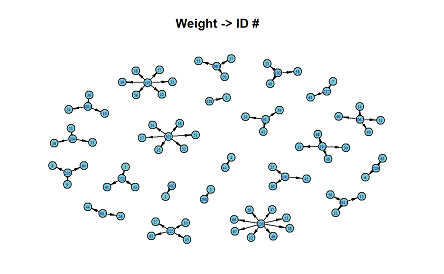

<br/>

## Testing instrument

This project includes an [Example Instrument]
(../../modules/advanced_graphs_v4.0.0/docs/AdvancedGraphsDemoProject_2020-01-15.zip) 
that includes fields, data and reports that can be used to produce each of the type of graphs included in Advanced Graphs. 
It is suitable for testing or demonstration purposes.

## Limitations

Default reports **A** (All data) and **B** (Selected instruments) from "Data Exports, Reports, and Stats" are not considered in Advanced Graphs.

**Checkboxes** in graphs do not work if options are combined into a single column.

**Live filters** are not considered when displaying the graphs and/or tables.

Signature, file upload, slider, descriptive and dynamic SQL fields are not considered for any graph.


## Acknowledgements
 * The original version in R was devised by Victor Espinosa at Vancouver Island Health Authority.  
 * Alvaro Ciganda wrote the plugin to trigger the graphs and greatly contributed to improve the efficiency in the R code.
 * Joel Cohen designed and implemented the current version written in javascript.
 * Morris Chukman contributed with added functionality and debugging.
 * David Cherry is the current lead programmer for the module and improved its functionality.
